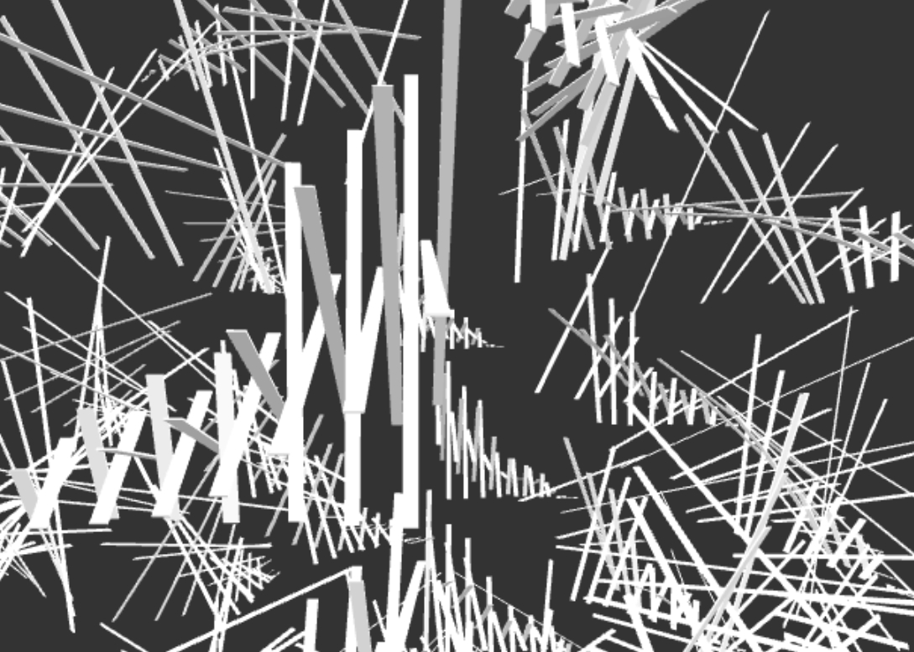
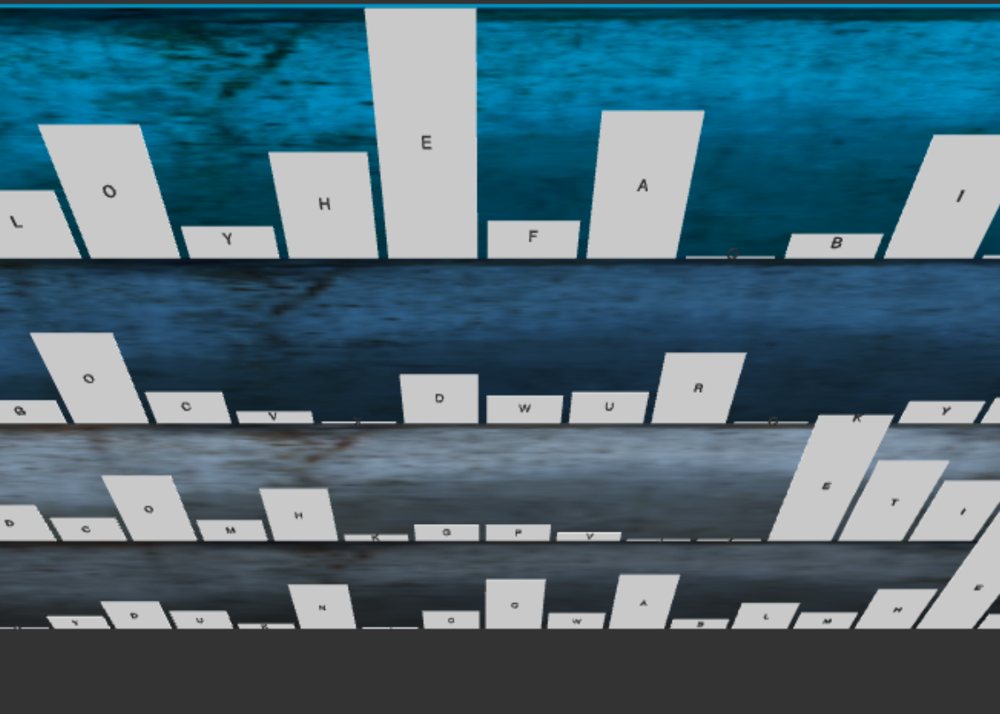
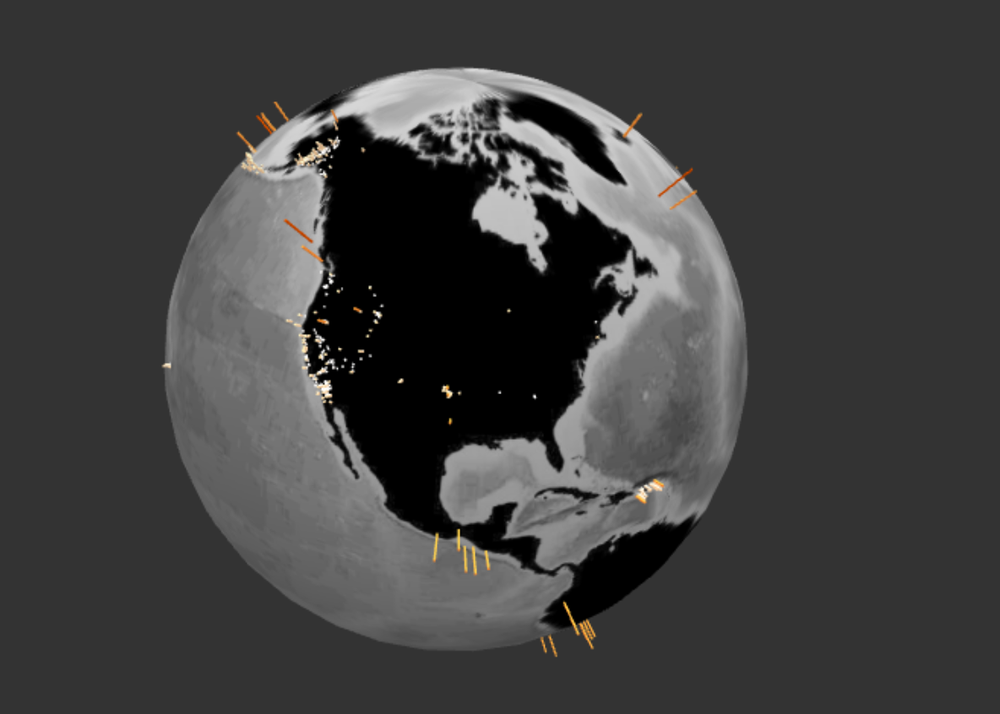
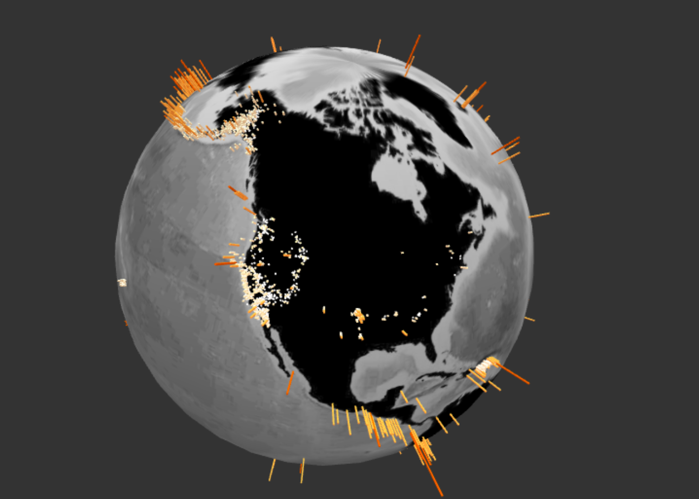
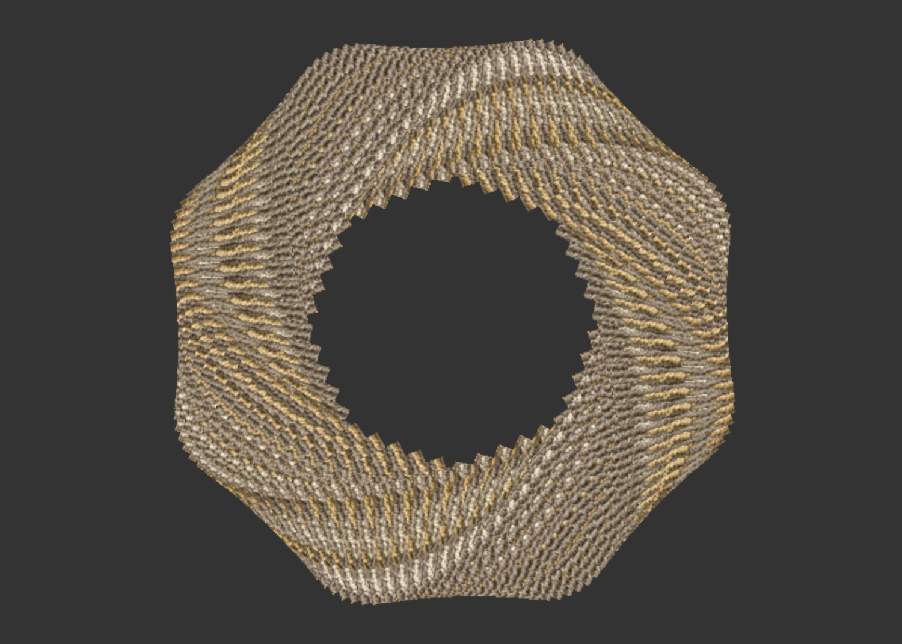
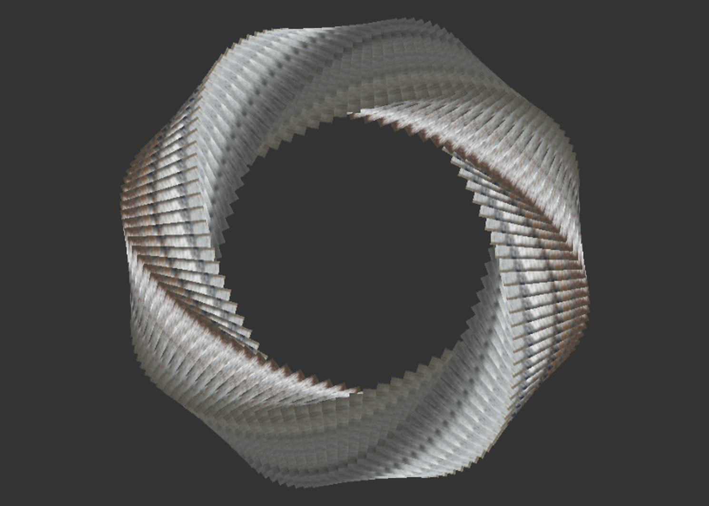
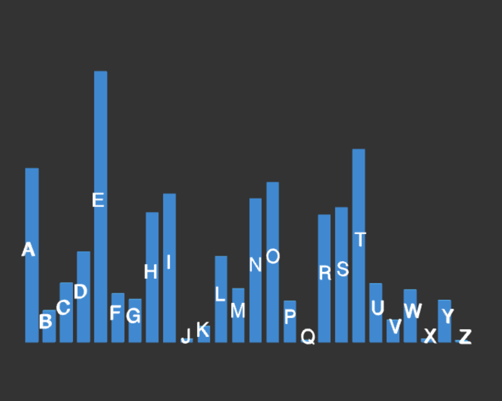
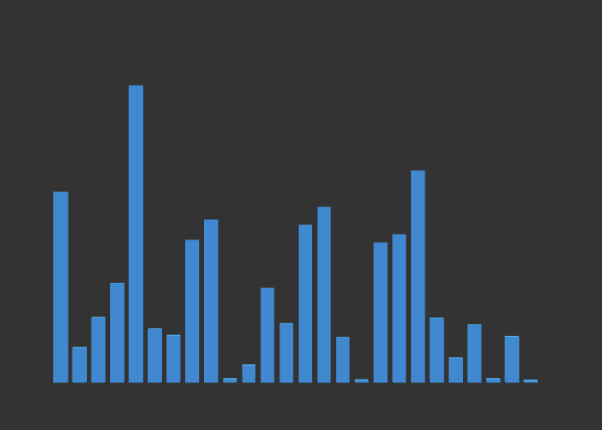

<h2>Subunit</h2>
<h4>Selections in THREE.js</h4>

A small library that gives you D3 style selections in WebGL to do awesome stuff, quickly.  You can select into a THREE.js scene graph just like you are selecting into the DOM with D3.

```html
npm install subunit
```

```html
bower install subunit
```










To run the demos locally...

1. clone the repo
2. cd subunit
2. npm install && npm start

That will fire up a dev server and open your browser to the demos index.
