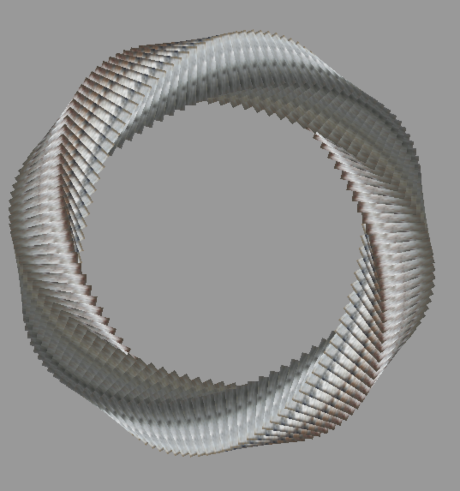
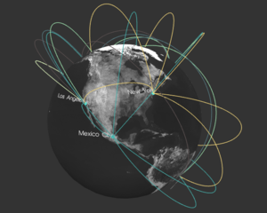

<h2>SubUnit</h2>
<h4>Selections in THREE.js</h4>

SubUnit gives you an ES6 version of D3 selections that work against a THREE.js scene graph.  It allows you to select into the scene and use D3 style syntax.


```html
npm install subunit
```

```html
bower install subunit
```





To run the demos, type npm install in the root folder to get the dependencies for the demos.

Run a local server from the root folder...

```html
cd subunit
python -m SimpleHTTPServer 8000 (or your favorite local server)
```
