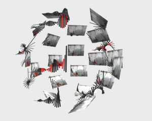

<h2>SubUnit</h2>
<h4>D3 Selections in THREE.js</h4>

[Intro Blog Post](http://www.delimited.io/blog/2015/1/21/selections-in-threejs)
[Demos](http://www.delimited.io/demos)

SubUnit is a super small library (~600 lines) that allows you to rapidly prototype interactive 3D interfaces and data visualizations in WebGL. It sits on top of THREE.js and allows you to select into in the scene graph.




Check it out using bower...

```html
bower install subunit
```

To run the demos...do another bower install in the demos folder to load the dependencies.

```html
cd subunit/demos
bower install
```
Run a local server from the root folder...

```html
cd subunit
python -m SimpleHTTPServer 8000 (or your favorite local server)
```
